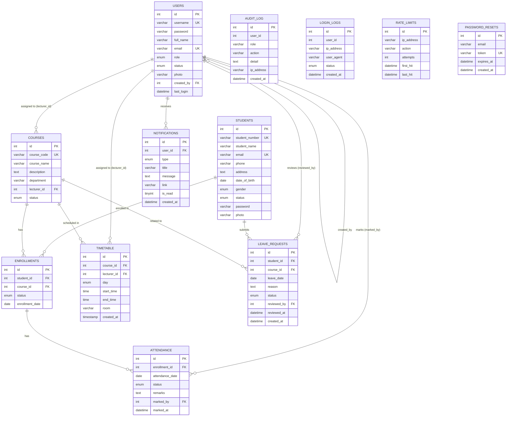

# ER Diagram & Third Normal Form (3NF) Analysis
## SLGTI Attendance Management System

---

## 1. Entity-Relationship Diagram

---

## 2. Third Normal Form (3NF) Analysis

### What 3NF Requires
- **1NF**: All attributes are atomic; no repeating groups.
- **2NF**: No partial dependency — every non-key attribute depends on the *whole* primary key (relevant for composite keys).
- **3NF**: No transitive dependency — no non-key attribute depends on another non-key attribute.

---

### 2.1 USERS

| Attribute | Depends On |
|-----------|-----------|
| username, password, full_name, email, role, status, photo, created_by, last_login | `id` (PK) |

- All attributes depend directly on `id`.
- `created_by` is a FK to `users.id` — not a transitive dependency, it's a reference.
- **Status: 3NF ✓**

---

### 2.2 STUDENTS

| Attribute | Depends On |
|-----------|-----------|
| student_number, student_name, email, phone, address, date_of_birth, gender, status, password, photo | `id` (PK) |

- All attributes depend directly on `id`.
- `student_number` is a candidate key (unique) but not the PK — no issue.
- **Status: 3NF ✓**

---

### 2.3 COURSES

| Attribute | Depends On |
|-----------|-----------|
| course_code, course_name, description, department, lecturer_id, status | `id` (PK) |

- All attributes depend directly on `id`.
- `department` is stored directly on the course (not derived from another table). This is acceptable for a fixed, small domain (5 values). If departments needed their own attributes (e.g., head of department, room block), a separate `DEPARTMENTS` table would be warranted.
- `lecturer_id` is a FK — not a transitive dependency.
- **Status: 3NF ✓**

> Note: If the department list grows or gains its own attributes, extract to a `DEPARTMENTS(id, name, code_prefix)` table and replace `department` with `department_id FK`.

---

### 2.4 ENROLLMENTS

| Attribute | Depends On |
|-----------|-----------|
| student_id, course_id, status, enrollment_date | `id` (PK) |

- The natural composite key would be `(student_id, course_id)` — a unique constraint is enforced on this pair.
- `status` and `enrollment_date` depend on the enrollment event, not on `student_id` or `course_id` alone — no partial dependency.
- **Status: 3NF ✓**

---

### 2.5 ATTENDANCE

| Attribute | Depends On |
|-----------|-----------|
| enrollment_id, attendance_date, status, remarks, marked_by, marked_at | `id` (PK) |

- The natural key is `(enrollment_id, attendance_date)` — upsert logic enforces uniqueness on this pair.
- `status` and `remarks` describe the attendance event, not the enrollment or date alone — no partial dependency.
- `marked_by` and `marked_at` describe who recorded the event — depend on the full record, not a subset.
- **Status: 3NF ✓**

---

### 2.6 TIMETABLE

| Attribute | Depends On |
|-----------|-----------|
| course_id, lecturer_id, day, start_time, end_time, room, created_at | `id` (PK) |

- All attributes describe a single scheduled slot.
- `lecturer_id` is redundant if `courses.lecturer_id` already assigns a lecturer to a course. However, it allows a slot to be taught by a substitute lecturer, so it is intentional and not a transitive dependency.
- `room` depends on the slot, not on the course or lecturer alone.
- **Status: 3NF ✓**

> Note: `lecturer_id` in `timetable` is technically derivable from `courses.lecturer_id` for the normal case. If substitutes are not a use case, it can be removed to reduce redundancy.

---

### 2.7 LEAVE_REQUESTS

| Attribute | Depends On |
|-----------|-----------|
| student_id, course_id, leave_date, reason, status, reviewed_by, reviewed_at, created_at | `id` (PK) |

- All attributes depend directly on `id`.
- `reviewed_by` and `reviewed_at` are NULL until reviewed — this is a valid nullable dependency on the same PK.
- **Status: 3NF ✓**

---

### 2.8 NOTIFICATIONS

| Attribute | Depends On |
|-----------|-----------|
| user_id, type, title, message, link, is_read, created_at | `id` (PK) |

- All attributes depend directly on `id`.
- `user_id` is a FK — not a transitive dependency.
- **Status: 3NF ✓**

---

### 2.9 AUDIT_LOG

| Attribute | Depends On |
|-----------|-----------|
| user_id, role, action, detail, ip_address, created_at | `id` (PK) |

- `role` is stored directly (denormalized from `users.role`). This is intentional for audit integrity — the role at the time of the action is preserved even if the user's role changes later.
- **Status: 3NF ✓** (intentional historical snapshot)

---

### 2.10 LOGIN_LOGS

| Attribute | Depends On |
|-----------|-----------|
| user_id, ip_address, user_agent, status, created_at | `id` (PK) |

- All attributes depend directly on `id`.
- `user_id` is a soft FK (no enforced constraint) to allow logging failed attempts for non-existent users.
- **Status: 3NF ✓**

---

### 2.11 RATE_LIMITS

| Attribute | Depends On |
|-----------|-----------|
| ip_address, action, attempts, first_hit, last_hit | `id` (PK) |

- The natural key is `(ip_address, action)` — indexed for lookup.
- `attempts`, `first_hit`, `last_hit` all describe the rate-limit window for that IP+action pair.
- **Status: 3NF ✓**

---

### 2.12 PASSWORD_RESETS

| Attribute | Depends On |
|-----------|-----------|
| email, token, expires_at, created_at | `id` (PK) |

- `token` is a candidate key (unique).
- `expires_at` depends on `id` (the reset request), not on `email` or `token` independently.
- **Status: 3NF ✓**

---

## 3. Summary of Relationships

| Relationship | Type | FK Location |
|---|---|---|
| USERS → COURSES (lecturer) | 1 : N | `courses.lecturer_id` |
| USERS → USERS (created_by) | 1 : N (self) | `users.created_by` |
| STUDENTS → ENROLLMENTS | 1 : N | `enrollments.student_id` |
| COURSES → ENROLLMENTS | 1 : N | `enrollments.course_id` |
| ENROLLMENTS → ATTENDANCE | 1 : N | `attendance.enrollment_id` |
| COURSES → TIMETABLE | 1 : N | `timetable.course_id` |
| USERS → TIMETABLE (lecturer) | 1 : N | `timetable.lecturer_id` |
| STUDENTS → LEAVE_REQUESTS | 1 : N | `leave_requests.student_id` |
| COURSES → LEAVE_REQUESTS | 1 : N | `leave_requests.course_id` |
| USERS → LEAVE_REQUESTS (reviewer) | 1 : N | `leave_requests.reviewed_by` |
| USERS → NOTIFICATIONS | 1 : N | `notifications.user_id` |
| USERS → ATTENDANCE (marked_by) | 1 : N | `attendance.marked_by` |

> STUDENTS ↔ COURSES is a **many-to-many** relationship resolved through the **ENROLLMENTS** junction table.

---

## 4. Potential Improvements Beyond 3NF

| Issue | Current State | Recommendation |
|---|---|---|
| `courses.department` is a string enum | Stored as VARCHAR | Extract to `departments(id, name, code_prefix)` table if departments gain attributes |
| `timetable.lecturer_id` duplicates `courses.lecturer_id` | Intentional for substitutes | Document the intent; remove if substitutes are not needed |
| `audit_log.role` duplicates `users.role` | Intentional historical snapshot | Keep as-is for audit integrity |
| `notifications` has no FK constraint on `user_id` | Soft reference | Add FK if orphan notifications are a concern |

---

*End of ER Diagram & 3NF Analysis*
