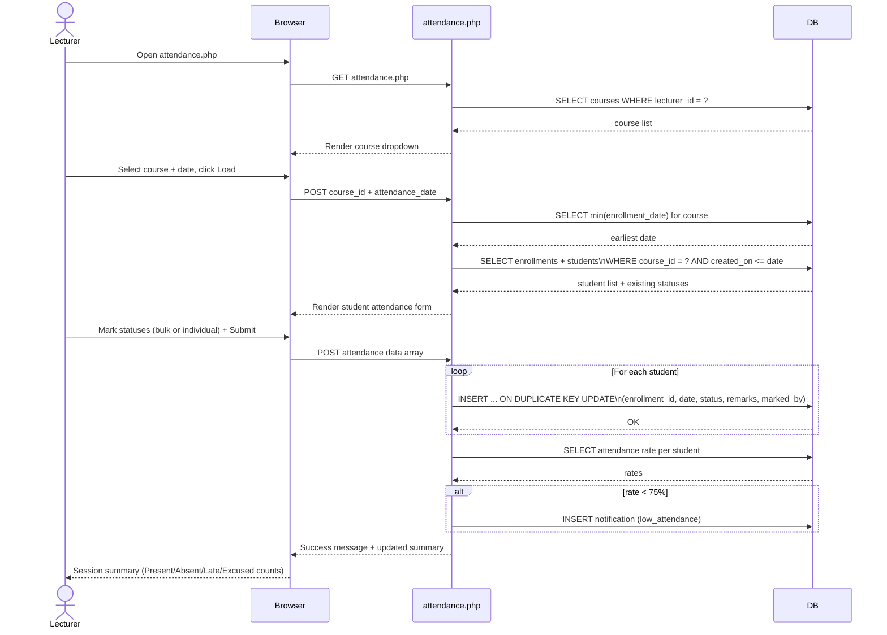
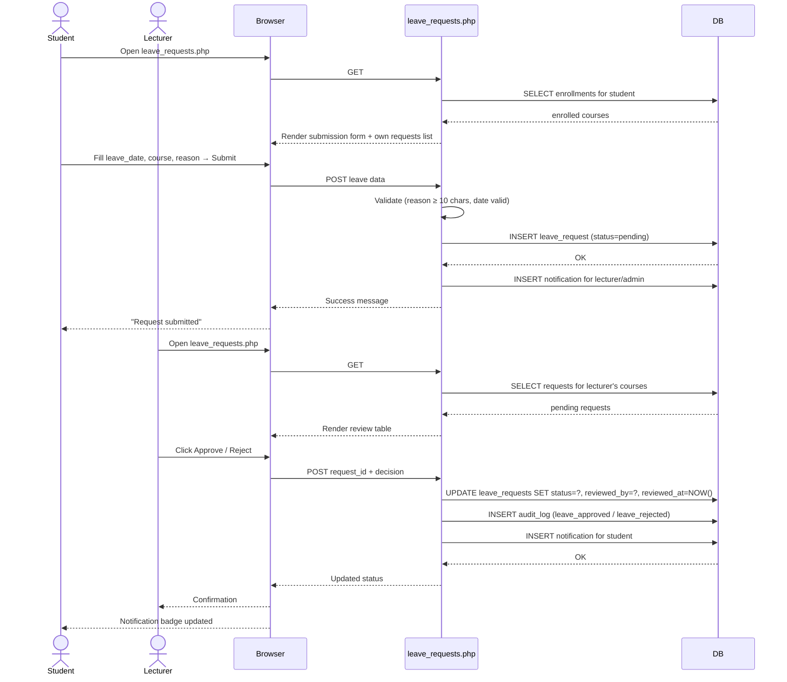
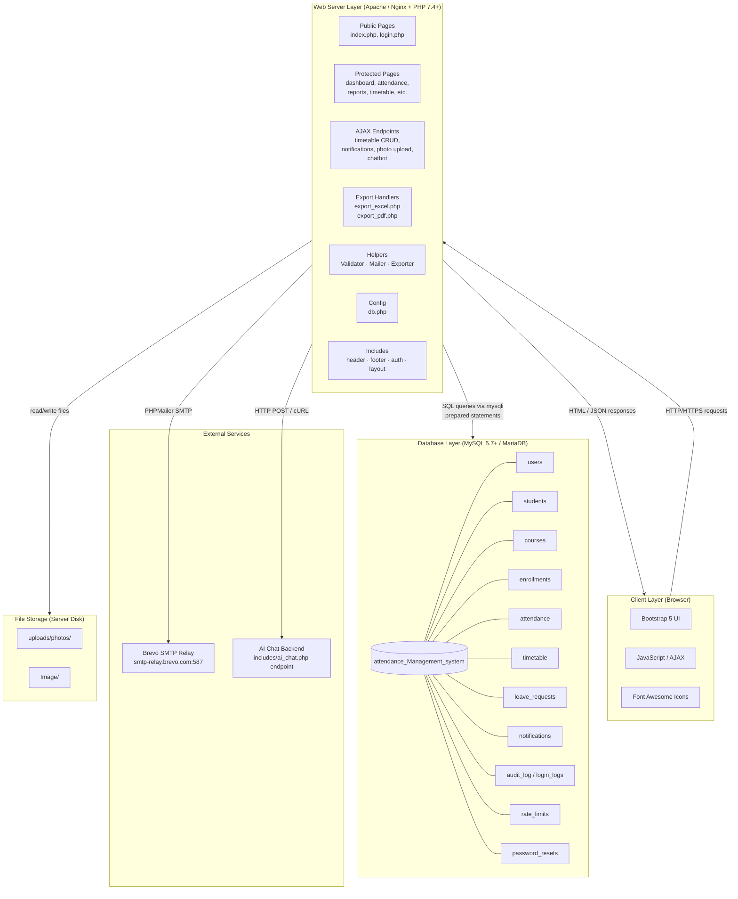
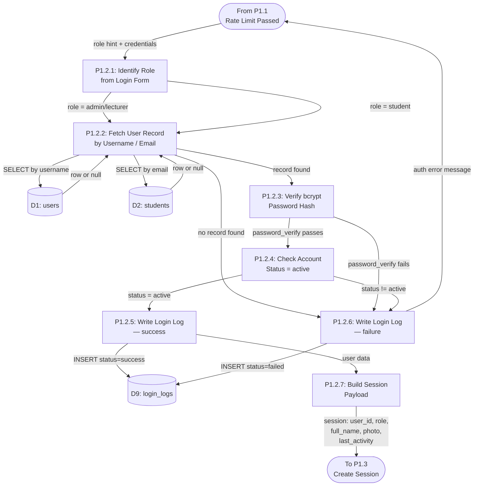
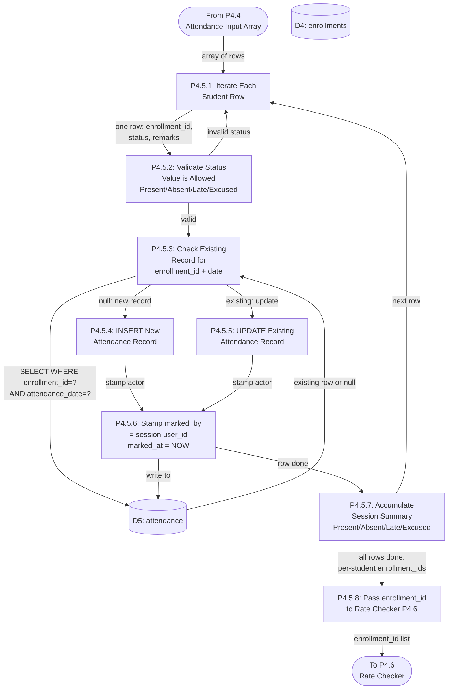
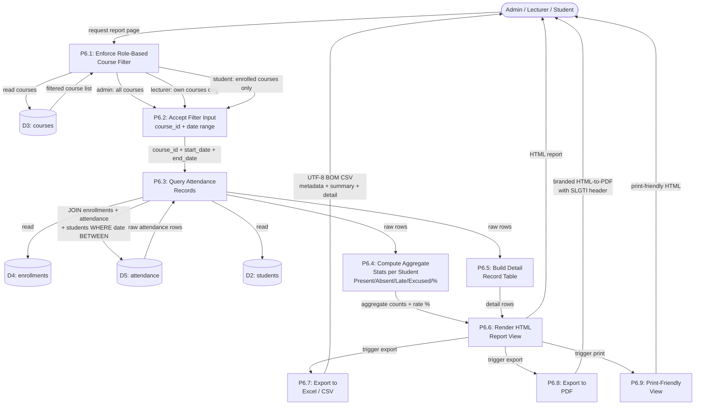

# System Diagrams
## SLGTI Attendance Management System

---

## 1. Context Diagram (Level 0 DFD)

Shows the system as a single process and all external entities that interact with it.

```mermaid
graph TD
    Admin([👤 Admin])
    Lecturer([👤 Lecturer])
    Student([👤 Student])
    EmailSrv([📧 Brevo SMTP\nEmail Server])
    AIChatBot([🤖 AI Chat\nBackend])

    AMS[["⚙️ SLGTI Attendance\nManagement System"]]

    Admin -->|Manage users, courses,\nenrollments, timetable,\nimport CSV, audit logs| AMS
    Lecturer -->|Mark attendance,\nreview leave requests,\nview reports & timetable| AMS
    Student -->|View attendance,\nsubmit leave requests,\nview timetable & notifications| AMS

    AMS -->|Dashboards, reports,\nnotifications, confirmations| Admin
    AMS -->|Attendance forms,\nreports, notifications| Lecturer
    AMS -->|Attendance records,\nleave status, timetable| Student

    AMS -->|Transactional emails\n(password reset, warnings,\nwelcome, summaries)| EmailSrv
    AMS -->|User query| AIChatBot
    AIChatBot -->|AI response| AMS
```

---

## 2. Data Flow Diagram — Level 1

Breaks the system into its major functional processes and shows data flows between them, external entities, and data stores.

```mermaid
graph TD
    %% External Entities
    Admin([Admin])
    Lecturer([Lecturer])
    Student([Student])
    SMTP([Brevo SMTP])
    AI([AI Backend])

    %% Data Stores
    DS1[(D1: users)]
    DS2[(D2: students)]
    DS3[(D3: courses)]
    DS4[(D4: enrollments)]
    DS5[(D5: attendance)]
    DS6[(D6: timetable)]
    DS7[(D7: leave_requests)]
    DS8[(D8: notifications)]
    DS9[(D9: audit_log /\nlogin_logs)]
    DS10[(D10: rate_limits)]

    %% Processes
    P1[P1: Authentication\n& Session Mgmt]
    P2[P2: User & Student\nManagement]
    P3[P3: Course &\nEnrollment Mgmt]
    P4[P4: Attendance\nMarking]
    P5[P5: Timetable\nManagement]
    P6[P6: Reports &\nExport]
    P7[P7: Leave Request\nWorkflow]
    P8[P8: Notifications\n& Alerts]
    P9[P9: Audit Logging]
    P10[P10: AI Chatbot]
    P11[P11: Profile Photo\nManagement]
    P12[P12: Email\nNotifications]

    %% Auth flows
    Admin -->|credentials| P1
    Lecturer -->|credentials| P1
    Student -->|email + student no.| P1
    P1 -->|read/write session| DS1
    P1 -->|read student record| DS2
    P1 -->|log attempt| DS9
    P1 -->|check/update limits| DS10
    P1 -->|auth result| Admin
    P1 -->|auth result| Lecturer
    P1 -->|auth result| Student

    %% User & Student Mgmt
    Admin -->|create/edit/delete\nstaff & students, CSV import| P2
    P2 -->|read/write| DS1
    P2 -->|read/write| DS2
    P2 -->|log action| DS9

    %% Course & Enrollment
    Admin -->|add/edit/delete\ncourses & enrollments| P3
    P3 -->|read/write| DS3
    P3 -->|read/write| DS4
    P3 -->|read users| DS1
    P3 -->|read students| DS2
    P3 -->|log action| DS9

    %% Attendance
    Lecturer -->|select course + date,\nmark statuses| P4
    P4 -->|read enrollments| DS4
    P4 -->|read students| DS2
    P4 -->|upsert records| DS5
    P4 -->|trigger alert| P8

    %% Timetable
    Admin -->|add/edit/delete slots| P5
    Lecturer -->|view slots| P5
    Student -->|view slots| P5
    P5 -->|read/write| DS6
    P5 -->|read courses| DS3

    %% Reports & Export
    Admin -->|filter by course/date| P6
    Lecturer -->|filter own courses| P6
    Student -->|view own records| P6
    P6 -->|read| DS5
    P6 -->|read| DS4
    P6 -->|read| DS3
    P6 -->|read| DS2
    P6 -->|Excel/PDF file| Admin
    P6 -->|Excel/PDF file| Lecturer
    P6 -->|attendance report| Student

    %% Leave Requests
    Student -->|submit leave request| P7
    Lecturer -->|approve/reject| P7
    Admin -->|approve/reject| P7
    P7 -->|read/write| DS7
    P7 -->|log action| DS9
    P7 -->|trigger notification| P8

    %% Notifications
    P8 -->|read/write| DS8
    P8 -->|read attendance| DS5
    P8 -->|read enrollments| DS4
    P8 -->|notification| Admin
    P8 -->|notification| Lecturer
    P8 -->|notification| Student
    P8 -->|trigger email| P12

    %% Audit Log
    P9 -->|write| DS9
    Admin -->|view audit log| P9

    %% AI Chatbot
    Admin -->|query| P10
    Lecturer -->|query| P10
    Student -->|query| P10
    P10 -->|read attendance| DS5
    P10 -->|read enrollments| DS4
    P10 -->|read courses| DS3
    P10 -->|read students| DS2
    P10 -->|send query| AI
    AI -->|response| P10
    P10 -->|AI response| Admin
    P10 -->|AI response| Lecturer
    P10 -->|AI response| Student

    %% Profile Photo
    Admin -->|upload/remove photos| P11
    Lecturer -->|upload own photo| P11
    Student -->|upload own photo| P11
    P11 -->|update photo path| DS1
    P11 -->|update photo path| DS2

    %% Email
    P12 -->|send via SMTP| SMTP
```



---

## 3. Use Case Diagram

```mermaid
graph TD
    %% Actors
    Admin([👤 Admin])
    Lecturer([👤 Lecturer])
    Student([👤 Student])

    %% ── Authentication ──
    subgraph UC_AUTH [Authentication]
        UC1(Login)
        UC2(Logout)
        UC3(Forgot Password)
        UC4(Change Password)
    end

    %% ── User & Student Management ──
    subgraph UC_USR [User & Student Management]
        UC5(Manage Staff Accounts)
        UC6(Manage Student Records)
        UC7(Bulk Import Students via CSV)
    end

    %% ── Course & Enrollment ──
    subgraph UC_CRS [Course & Enrollment]
        UC8(Manage Courses)
        UC9(Manage Enrollments)
        UC10(View My Courses)
    end

    %% ── Attendance ──
    subgraph UC_ATT [Attendance]
        UC11(Mark Attendance)
        UC12(View Attendance Records)
    end

    %% ── Timetable ──
    subgraph UC_TT [Timetable]
        UC13(Manage Timetable)
        UC14(View Timetable)
    end

    %% ── Reports & Export ──
    subgraph UC_RPT [Reports & Export]
        UC15(View Attendance Reports)
        UC16(Export to Excel)
        UC17(Export to PDF)
    end

    %% ── Leave Requests ──
    subgraph UC_LVE [Leave Requests]
        UC18(Submit Leave Request)
        UC19(Review Leave Requests)
    end

    %% ── Notifications ──
    subgraph UC_NOT [Notifications]
        UC20(View Notifications)
        UC21(Mark Notifications as Read)
    end

    %% ── System Admin ──
    subgraph UC_SYS [System Administration]
        UC22(View Audit Log)
        UC23(Manage Profile Photo)
        UC24(View Calendar)
        UC25(Use AI Chatbot)
    end

    %% ── Actor → Use Case links ──

    %% All roles
    Admin --- UC1
    Lecturer --- UC1
    Student --- UC1
    Admin --- UC2
    Lecturer --- UC2
    Student --- UC2
    Admin --- UC3
    Lecturer --- UC3
    Student --- UC3
    Admin --- UC4
    Lecturer --- UC4
    Student --- UC4

    Admin --- UC5
    Admin --- UC6
    Admin --- UC7

    Admin --- UC8
    Admin --- UC9
    Lecturer --- UC10

    Lecturer --- UC11
    Admin --- UC12
    Lecturer --- UC12
    Student --- UC12

    Admin --- UC13
    Lecturer --- UC14
    Student --- UC14

    Admin --- UC15
    Lecturer --- UC15
    Student --- UC15
    Admin --- UC16
    Lecturer --- UC16
    Student --- UC16
    Admin --- UC17
    Lecturer --- UC17
    Student --- UC17

    Student --- UC18
    Lecturer --- UC19
    Admin --- UC19

    Admin --- UC20
    Lecturer --- UC20
    Student --- UC20
    Admin --- UC21
    Lecturer --- UC21
    Student --- UC21

    Admin --- UC22
    Admin --- UC23
    Lecturer --- UC23
    Student --- UC23
    Admin --- UC24
    Lecturer --- UC24
    Student --- UC24
    Admin --- UC25
    Lecturer --- UC25
    Student --- UC25
```



---

## 4. DFD Level 2 — Authentication Process (P1 Exploded)

Drills into the login, session management, rate limiting, and forgot-password sub-processes.

```mermaid
graph TD
    Admin([Admin])
    Lecturer([Lecturer])
    Student([Student])

    DS_users[(D1: users)]
    DS_students[(D2: students)]
    DS_login_logs[(D9: login_logs)]
    DS_rate[(D10: rate_limits)]
    DS_pwd_reset[(D11: password_resets)]

    P1_1[P1.1: Check Rate Limit]
    P1_2[P1.2: Validate Credentials]
    P1_3[P1.3: Create Session]
    P1_4[P1.4: Log Login Attempt]
    P1_5[P1.5: Forgot Password\n— Verify Identity]
    P1_6[P1.6: Forgot Password\n— Reset Token]
    P1_7[P1.7: Session Timeout\n& Regeneration]

    Admin -->|username + password| P1_1
    Lecturer -->|username + password| P1_1
    Student -->|email + student no.| P1_1

    P1_1 -->|check attempts| DS_rate
    DS_rate -->|attempt count| P1_1
    P1_1 -->|update attempts| DS_rate
    P1_1 -->|blocked: too many attempts| Admin
    P1_1 -->|blocked: too many attempts| Lecturer
    P1_1 -->|blocked: too many attempts| Student
    P1_1 -->|allowed: pass credentials| P1_2

    P1_2 -->|lookup user| DS_users
    P1_2 -->|lookup student| DS_students
    DS_users -->|hashed password + status| P1_2
    DS_students -->|hashed password + status| P1_2
    P1_2 -->|invalid: auth failed| P1_4
    P1_2 -->|valid: user data| P1_3

    P1_3 -->|write session vars\n(user_id, role, last_activity)| P1_7
    P1_3 -->|redirect to dashboard| Admin
    P1_3 -->|redirect to dashboard| Lecturer
    P1_3 -->|redirect to dashboard| Student

    P1_4 -->|write attempt record| DS_login_logs

    P1_7 -->|regenerate session ID\nevery 30 min| P1_3
    P1_7 -->|expire after 30 min idle| Admin
    P1_7 -->|expire after 30 min idle| Lecturer
    P1_7 -->|expire after 30 min idle| Student

    Admin -->|email / username| P1_5
    Lecturer -->|email / username| P1_5
    Student -->|email| P1_5
    P1_5 -->|lookup| DS_users
    P1_5 -->|lookup| DS_students
    P1_5 -->|identity verified: generate token| P1_6
    P1_6 -->|store token + expiry| DS_pwd_reset
    P1_6 -->|new password + token| DS_users
    P1_6 -->|new password + token| DS_students
```

---

## 5. DFD Level 2 — Attendance Marking Process (P4 Exploded)

```mermaid
graph TD
    Lecturer([Lecturer])

    DS_courses[(D3: courses)]
    DS_enroll[(D4: enrollments)]
    DS_students[(D2: students)]
    DS_att[(D5: attendance)]
    DS_notif[(D8: notifications)]

    P4_1[P4.1: Select Course\n& Date]
    P4_2[P4.2: Load Student List\nfor Session]
    P4_3[P4.3: Validate Date\n(not future, not before\nearliest enrollment)]
    P4_4[P4.4: Accept Attendance\nInput per Student]
    P4_5[P4.5: Upsert Attendance\nRecords]
    P4_6[P4.6: Check Attendance\nRate per Student]
    P4_7[P4.7: Generate Low-\nAttendance Alert]

    Lecturer -->|select course| P4_1
    P4_1 -->|read assigned courses| DS_courses
    DS_courses -->|course list| P4_1
    P4_1 -->|course_id + date| P4_3

    P4_3 -->|read earliest enrollment date| DS_enroll
    DS_enroll -->|min enrollment_date| P4_3
    P4_3 -->|valid date + course_id| P4_2

    P4_2 -->|read enrollments| DS_enroll
    P4_2 -->|read student details| DS_students
    DS_enroll -->|enrollment records| P4_2
    DS_students -->|student names + numbers| P4_2
    P4_2 -->|student list with existing status| Lecturer

    Lecturer -->|Present/Absent/Late/Excused\n+ optional remarks per student| P4_4
    P4_4 -->|bulk-mark or individual status| P4_5

    P4_5 -->|INSERT or UPDATE| DS_att
    DS_att -->|existing record (if any)| P4_5
    P4_5 -->|saved confirmation| Lecturer

    P4_5 -->|trigger rate check| P4_6
    P4_6 -->|read all records for student| DS_att
    P4_6 -->|attendance rate < 75%| P4_7
    P4_7 -->|write low_attendance notification| DS_notif
```

---

## 6. DFD Level 2 — Leave Request Workflow (P7 Exploded)

```mermaid
graph TD
    Student([Student])
    Lecturer([Lecturer])
    Admin([Admin])

    DS_leave[(D7: leave_requests)]
    DS_enroll[(D4: enrollments)]
    DS_courses[(D3: courses)]
    DS_audit[(D9: audit_log)]
    DS_notif[(D8: notifications)]

    P7_1[P7.1: Submit\nLeave Request]
    P7_2[P7.2: Validate Request\n(date, reason ≥10 chars)]
    P7_3[P7.3: Store Request\nas Pending]
    P7_4[P7.4: Notify Reviewer]
    P7_5[P7.5: Review Request\n(Approve / Reject)]
    P7_6[P7.6: Update Request\nStatus]
    P7_7[P7.7: Notify Student\nof Decision]
    P7_8[P7.8: Log Review\nAction]

    Student -->|leave_date, course (optional),\nreason| P7_1
    P7_1 -->|read enrolled courses| DS_enroll
    DS_enroll -->|course list| P7_1
    P7_1 -->|form data| P7_2
    P7_2 -->|invalid: error message| Student
    P7_2 -->|valid: request data| P7_3
    P7_3 -->|INSERT pending record| DS_leave
    P7_3 -->|trigger notification| P7_4
    P7_4 -->|write notification| DS_notif
    P7_4 -->|notify| Lecturer
    P7_4 -->|notify| Admin

    Lecturer -->|approve or reject + remarks| P7_5
    Admin -->|approve or reject + remarks| P7_5
    P7_5 -->|read request| DS_leave
    P7_5 -->|read course ownership| DS_courses
    DS_leave -->|pending request| P7_5
    P7_5 -->|decision| P7_6
    P7_6 -->|UPDATE status + reviewed_by + reviewed_at| DS_leave
    P7_6 -->|trigger student notification| P7_7
    P7_6 -->|log action| P7_8
    P7_7 -->|write notification| DS_notif
    P7_7 -->|decision notification| Student
    P7_8 -->|write audit record| DS_audit
```

---

## 7. System Sequence Diagram — Mark Attendance Flow

Shows the interaction between the Lecturer, browser, server, and database for a complete attendance marking session.



---

## 8. System Sequence Diagram — Student Leave Request & Review



---

## 9. Deployment / Architecture Diagram

Shows the physical and logical layers of the deployed system.



---

---

## 10. DFD Level 3 — Authentication: Credential Validation (P1.2 Exploded)

Drills into exactly how the system validates a login credential — bcrypt check, status check, role routing.



---

## 11. DFD Level 3 — Attendance: Upsert Records (P4.5 Exploded)

Drills into the exact upsert logic for each attendance row submitted by the lecturer.



---

## 12. DFD Level 3 — Reports & Export: Build Report (P6 Exploded)



---

## 13. DFD Level 3 — Notifications & Alerts (P8 Exploded)

```mermaid
graph TD
    P4([From P4\nAttendance Saved])
    P7([From P7\nLeave Request Reviewed])
    P3([From P3\nNew Enrollment])

    DS_att[(D5: attendance)]
    DS_enroll[(D4: enrollments)]
    DS_notif[(D8: notifications)]
    DS_users[(D1: users)]
    DS_students[(D2: students)]

    P8_1[P8.1: Receive Trigger\nEvent]
    P8_2[P8.2: Compute Attendance\nRate for Student]
    P8_3[P8.3: Check if Rate\n< 75% Threshold]
    P8_4[P8.4: Check Duplicate\nNotification\n(avoid spam)]
    P8_5[P8.5: Write low_attendance\nNotification]
    P8_6[P8.6: Write leave_decision\nNotification to Student]
    P8_7[P8.7: Write new_enrollment\nNotification]
    P8_8[P8.8: Resolve Target\nUser ID]
    P8_9[P8.9: AJAX Badge\nCount Update]
    P8_10[P8.10: Trigger Email\nif Critical]
    P12([To P12\nEmail Notifications])

    P4 -->|enrollment_id| P8_1
    P7 -->|student_id + decision| P8_1
    P3 -->|student_id + course_id| P8_1

    P8_1 -->|attendance trigger| P8_2
    P8_1 -->|leave decision trigger| P8_6
    P8_1 -->|enrollment trigger| P8_7

    P8_2 -->|SELECT COUNT per status| DS_att
    DS_att -->|counts| P8_2
    P8_2 -->|rate %| P8_3
    P8_3 -->|rate >= 75%: no action| P8_1
    P8_3 -->|rate < 75%| P8_4

    P8_4 -->|SELECT recent low_attendance\nnotif for same student| DS_notif
    DS_notif -->|existing notif or null| P8_4
    P8_4 -->|duplicate exists: skip| P8_1
    P8_4 -->|no duplicate| P8_5

    P8_5 -->|resolve student → user_id| P8_8
    P8_6 -->|resolve student → user_id| P8_8
    P8_7 -->|resolve student → user_id| P8_8

    P8_8 -->|lookup| DS_users
    P8_8 -->|lookup| DS_students
    DS_users -->|user_id| P8_8
    DS_students -->|user_id| P8_8

    P8_8 -->|INSERT notification row| DS_notif
    DS_notif -->|saved| P8_9
    P8_9 -->|unread count JSON| P8_9

    P8_5 -->|low attendance: send email| P8_10
    P8_10 -->|email trigger| P12
```

---

## 14. DFD Level 3 — User & Student Management (P2 Exploded)

```mermaid
graph TD
    Admin([Admin])

    DS_users[(D1: users)]
    DS_students[(D2: students)]
    DS_audit[(D9: audit_log)]

    P2_1[P2.1: Create Staff\nAccount]
    P2_2[P2.2: Edit Staff\nAccount]
    P2_3[P2.3: Delete Staff\nAccount]
    P2_4[P2.4: Create / Edit\nStudent Record]
    P2_5[P2.5: Delete Student\nRecord]
    P2_6[P2.6: Bulk Import\nStudents via CSV]
    P2_7[P2.7: Validate Input\n(Validator cl
